# Energy-aware scheduling: design and evaluation plan

CS 350M Energy-Efficient Computing — October 4, 2026

This document develops a family of scheduling policies for the supplied eight-core simulator. Its purpose is to explain what makes a decision save energy, identify relevant state-of-the-art approaches, and define experiments that can distinguish them. It does not claim that one unmeasured policy is the final optimum.

Implementation follow-up: the original research and alternatives below are retained as the design record. The scheduler is now implemented and benchmarked; see [measured results](scheduler-results.md) for the selected policy, correctness checks, 17-configuration sweep, and simulator-specific energy-minimum derivation. Questions described below as open reflect the planning stage unless addressed in that report.

The central design principle is to jointly choose **which cores run, their P-states, and the idle states of the remaining cores**. Minimizing instantaneous power alone is insufficient: slower execution can increase the energy consumed by every core that remains idle. Conversely, faster completion is useful only when the resulting idle interval actually saves enough energy.

## 1. Objective, scope, and admissible behavior

The primary objective is:

```text
minimize E_final = GetTotalEnergyConsumed() at SimulationComplete(Time_t now)
```

For a fixed generated workload, every created process must execute all its required work and finish exactly once. A valid policy preserves context, obeys transition restrictions, eventually serves every process, and allows the simulator to reach its normal completion event. Reducing energy by abandoning work, changing remaining work, suppressing events, or preventing normal completion is outside the objective.

The assignment does not provide deadlines or a maximum acceptable runtime. Therefore, evaluate energy as the primary metric and report runtime and response time alongside it. Evaluate two explicitly different operating modes:

1. **Energy-only:** minimize final energy subject to correctness and eventual completion. Concrete online batching policies should declare a finite maximum delay rather than relying on arrivals continuing forever.
2. **Service-constrained:** minimize energy among policies satisfying a stated runtime or waiting-time limit. Sweep that limit to expose the energy–latency tradeoff.

The batching bound and service limits are design parameters, not requirements implied by the assignment. Do not silently replace the requested objective with energy-delay product, throughput, or an arbitrary weighted score.

The accounting horizon is the actual end of the simulator's event queue. It may include future arrivals and already queued timer events after a particular process finishes. Shutdown in `SimulationComplete` cannot retroactively reduce energy already consumed. The scheduler must create savings during the run.

## 2. What the supplied simulator actually exposes

The repository includes scheduler source and simulator headers, but the CPU, event-loop, and generator implementations are supplied in `src/libsim.so`. The following findings combine source inspection, inspection of that library's named tables and routines, and isolated runtime probes. They apply to this binary, not necessarily to another instructor version.

| Observation | Design consequence |
| --- | --- |
| Four big cores are numbered 0–3; four small cores are 4–7. | Keep separate capacity and energy tables for the two types. |
| The original starter scheduler had one `running` PID and used only core 0. | A multicore design needs eight ownership records and a PID-to-core map. |
| `GetRemaining(pid)` is declared in `interfaces.h` and exported by the library. | A workload-aware variant can inspect unfinished work, if this exposed helper is permitted. Keep a queue-only variant for comparison. |
| No getter for current C-state or P-state is exposed. | Maintain scheduler-owned state and explicit transition status. |
| CPU construction initializes cores to C1/P0. | Initialize bookkeeping consistently on the first callback; there is no scheduler initialization upcall. |
| `QUANTUM` is 1000; the probe observed consecutive timer callbacks 1000 raw clock units apart. | Express control periods and wake thresholds in measured clock units. |
| The CPU detaches a completed process and sets its core to C1 before `ExitProcess`. | Reuse that core directly; calling `SaveContext` on it would violate the C0 precondition. |
| A wake callback occurred before the timer upcall at the same timestamp. | Complete local wake bookkeeping there and perform global planning in `TimerInterrupt`. |

The relevant local contracts are in [interfaces.h](../src/interfaces.h), [sim_types.h](../src/sim_types.h), [core.hpp](../src/core.hpp), and [simulator.hpp](../src/simulator.hpp). The [reference starter](../tests/reference_starter.cpp) preserves the original policy; [scheduler.cpp](../src/scheduler.cpp) now contains the implemented energy-first policy.

### 2.1 Establish the clock and energy units before reporting physical values

There is a real discrepancy between the handout and the supplied implementation:

- The handout describes time as microseconds and energy as kWh.
- The starter prints `GetTotalEnergyConsumed() / 3600000000.0` as kWh.
- The CPU header labels its accumulated energy as joules, but the inspected accounting routine multiplies elapsed `Now()` directly by its rate table, without an explicit microsecond-to-second conversion.
- For the measured baseline, raw time `109121000` is printed as `30:18:41`. That is consistent with treating the raw value as milliseconds and formatting hours/minutes/seconds, rather than using the handout's microseconds.

Use **raw clock units** and **raw energy units** throughout policy calculations. Record the existing displayed kWh value separately. Do not claim that the raw counter is joules or apply a replacement conversion until the instructor confirms the convention. A constant positive conversion does not change which policy minimizes the counter.

`TimerEvent::Execute()` also passes `time >> 2` to the CPU handler. This appears to participate in internal event encoding: the runtime probe found `TimerInterrupt(now) == Now()` at the sampled timestamps. Use `Now()` for scheduler timestamps; do not introduce another factor-of-four conversion.

### 2.2 Reproducible starter baseline

The unchanged starter ran successfully using the existing `gcc:13` image in an isolated Linux/amd64 container. The library's default entry point calls `GenerateProcesses(0)`. An additional reporting wrapper around the starter's completion function recorded:

| Metric | Observed value |
| --- | --- |
| Final raw clock / `Now()` | 109121000 |
| Final raw `GetTotalEnergyConsumed()` | 7487041200 |
| Existing kWh display conversion | 2.0797336666666668 |
| Existing formatted time | `30:18:41` |

These are baseline measurements, not results for the proposed policies. The unit discrepancy above prevents treating the display as an independently validated physical measurement.

Library SHA-256:

```text
920e35872ffeb5ea3ed80fae7db343d86ffbc3f3a1f20e659d939bb9bc731f4b
```

## 3. Energy model and the first useful deductions

Let `r[c,p]` be useful work per raw clock unit, `P[c,p]` the active accounting rate, and `S[c,s]` the idle accounting rate. The names `P` and `S` denote power-like rates in simulator units; the values below are not independently calibrated watts.

For remaining work `w`, uninterrupted execution at a constant state approximately costs:

```text
execution time = w / r[c,p]
active energy  = w * P[c,p] / r[c,p]
```

Timer quantization and integer truncation require an event-aware correction for short jobs. These formulas are useful estimates rather than an exact replacement for the simulator.

### 3.1 Discrete P-state tables from the supplied library

The named arrays `dynamic`, `leakage`, `speed`, and `scale`, and the inspected CPU routines imply the following rates. Small-core active and idle rates are multiplied by 0.5; useful execution rate is multiplied by 0.6.

| State | Big work rate | Big dynamic + leakage | Big energy/work | Small work rate | Small active rate | Small energy/work |
| --- | ---: | ---: | ---: | ---: | ---: | ---: |
| P0 | 1.00 | 10.0 + 12.0 = 22.0 | 22.000 | 0.60 | 11.0 | 18.333 |
| P1 | 0.80 | 6.4 + 9.6 = 16.0 | 20.000 | 0.48 | 8.0 | 16.667 |
| P2 | 0.60 | 3.6 + 7.2 = 10.8 | 18.000 | 0.36 | 5.4 | 15.000 |
| P3 | 0.40 | 1.6 + 4.0 = 5.6 | 14.000 | 0.24 | 2.8 | 11.667 |
| P4 | 0.20 | 1.6 + 2.0 = 3.6 | 18.000 | 0.12 | 1.8 | 15.000 |

This creates a concrete starting hypothesis: **P3 is the best constant active state when the rest of the chip contributes negligible energy and there is no completion-time constraint.** P4 halves P3's work rate but reduces active rate by only about 36%, increasing active energy per work by about 29%. That conclusion follows from the discrete table; it does not depend on assuming a cubic DVFS curve.

At the same P-state, small cores require `0.5 / 0.6 = 5/6` of the big core's active energy for equal work, approximately a 16.7% saving. This supports small-core placement as a baseline, but does not settle whole-chip energy.

The inspected progress model depends on core type and P-state, with no exposed task-specific cache, memory, or instruction-mix model. Work-aware placement can therefore distinguish job lengths and queue residence, but should not assume that different PIDs have different big/small speedups.

### 3.2 Idle-state tables and transition behavior

| State | Big idle rate | Small idle rate | Finding for this binary |
| --- | ---: | ---: | --- |
| C1 | 9.6 | 4.8 | Ready for context loading. |
| C2 | 9.6 | 4.8 | No rate advantage over C1 in the inspected table. |
| C3 | 4.0 | 2.0 | Inspected routine uses a 10-timer wake countdown. |
| C4 | 1.6 | 0.8 | Probe observed wake to C1 after 10 timers. |
| C6 | 0.0 | 0.0 | Probe observed wake to C1 after 2000 timers. |
| C7 | 0.0 | 0.0 | Package-wide shutdown; no idle-rate advantage over all cores in C6. |

C5 is excluded as required by the assignment. The measured C4 and C6 wake delays were 10000 and 2000000 raw clock units. Under the handout's microsecond convention those correspond to 10 ms and 2 s; physical interpretations remain subject to the unit discrepancy. In particular, a generic assumption that C6 wakes within a few timer ticks would be wrong for this library.

The inspected routine retains the old deep C-state while its wake countdown runs. Consequently, C6 wake time does not itself accrue a positive per-core rate in that routine, although waiting can extend the energy consumed elsewhere. An isolated P3 probe measured an aggregate rate of 6.4 while a small core remained in C4, and 5.6 after that core was returned to C6: `5.6 + 0.8` and `5.6`, respectively.

Do not invent a fixed transition-energy charge that the library does not account for. Measure any additional cost through counter differences and whole-system elapsed time. Also verify entry behavior: this binary's transition code does not simply implement every delay stated in the prose specification.

C2 is an experimental control rather than a promising saver here. C4 deserves an early comparison against C3. C6 deserves careful wake planning. C7 can initially be excluded: the accounted idle rate is already zero with all cores in C6, while C7 adds package coordination requirements.

### 3.3 Whole-chip energy can reverse the placement preference

Consider one job of work `w` in the final drain, with a constant background rate `B` from other cores, no switching cost, and completion immediately ending the accounting horizon:

```text
E_big   = (P_big + B) * w / r_big
E_small = (0.5 * P_big + B) * w / (0.6 * r_big)
```

The small core wins only when `B < 0.25 * P_big`. At P3, the threshold is 1.4 raw energy units per clock unit. One otherwise idle big core left in C4 already contributes 1.6. Under these assumptions, that background alone can reverse the small core's advantage. The practical response may be to sleep the idle core more deeply, rather than to use a big core for the job.

This example holds other-core background fixed; changing which core runs also changes which core idles. Use the full eight-core sum when comparing real placements.

If the horizon is fixed by a later arrival, faster completion instead creates additional idle residence. Compare active energy plus that residence through the shared horizon. If a core would otherwise idle at rate `S`, the incremental execution cost is `(P - S) * w / r`, provided the idle state and transitions really are the same in both alternatives. Apply the final-drain calculation only when time saved can shorten the accounted horizon.

### 3.4 More active cores need not consume more total energy

For `n` identical cores processing divisible work `W`, with zero idle rate and no activation cost:

```text
time = W / (n * r)
energy = n * P * time = P * W / r
```

Using four small cores can reduce runtime without increasing this ideal active energy. Consolidating onto one small core can lose once idle residence or a long completion tail matters. Conversely, waking extra cores for a short burst may provide no useful benefit before their transition completes.

For a more realistic estimate, use per-core assigned work `W_i`, execution time `t_i`, and common horizon `T`:

```text
E_est = sum_i [P_i * t_i + S_i * (T - t_i)] + measured transition effects
```

This expression assumes the chosen idle state is available for the entire indicated residence. A rollout should account for entry and wake delays explicitly.

## 4. State of the art: what transfers to this project

The relevant literature separates task placement, speed selection, and power-down decisions, then combines them through an energy model. The comparison below includes established production mechanisms, foundational optimal algorithms, and recent research available by the document date. “State of the art” does not imply a universal winner across these different problem definitions.

| Approach | Useful principle | Fit to the simulator |
| --- | --- | --- |
| Linux Energy Aware Scheduling (EAS) | Compare predicted system energy across placements. | Strong conceptual fit for big/small placement. |
| `schedutil` and PELT | Couple frequency decisions with measured demand. | Adapt demand tracking; use queue work rather than blindly copying utilization. |
| Critical-speed scheduling | Minimize active energy per useful work before adding timing constraints. | Directly applicable through the five-state table. |
| YDS / deadline speed scaling | Match speed to the density of constrained work. | Reference or optional deadline variant; deadlines are absent here. |
| Break-even dynamic power management | Sleep only when future residence justifies the transition. | Direct fit after measuring the simulator's costs. |
| Linux `menu` / TEO idle governors | Use idle-duration history, residency, and exit latency. | Adapt the prediction logic; timer visibility differs. |
| Learning-augmented scheduling | Exploit forecasts while retaining a robust fallback. | Useful for burst prediction and warm-core counts. |
| Short-horizon predictive control | Evaluate coupled placement, P-state, and sleep choices. | Practical extension because there are only eight cores. |
| Reinforcement learning | Learn power decisions from repeated workloads. | Research comparator if simple models leave a meaningful gap. |

### 4.1 Production placement and frequency control

Linux EAS estimates the energy effect of candidate placements using an energy model. Its interaction with `schedutil` keeps predicted and requested frequencies consistent. This supports using one model for both placement and P-state selection in this project. EAS also falls back to load-oriented balancing under over-utilization; its behavior should not be transplanted wholesale to a workload of continuously runnable simulated jobs. [Linux EAS documentation](https://docs.kernel.org/scheduler/sched-energy.html).

PELT uses exponentially weighted history to track demand, and `schedutil` relates that demand to capacity. Here, observed busy time alone is insufficient: a core running one very short job and one running a large backlog may both appear fully utilized. Prefer remaining runnable work and arrival-rate estimates when permitted, with queue length, age, and completion rate as the fallback. [Linux schedutil documentation](https://docs.kernel.org/scheduler/schedutil.html).

### 4.2 Critical speed and deadline-based speed scaling

Critical speed is the speed that minimizes energy per work when running and sleeping are both possible. For an illustrative continuous model `P(f) = a*f^alpha + b`, minimizing `P(f)/f` gives:

```text
f_critical = [b / (a * (alpha - 1))]^(1 / alpha), alpha > 1
```

Leakage creates a finite optimum; reducing frequency below it can increase total energy. For this simulator, use the actual discrete ratios in Section 3, rather than fitting this illustrative curve. The joint speed-scaling and sleep-state problem is treated in [Irani, Shukla, and Gupta, Algorithms for Power Savings, SODA 2003](https://mesl.ucsd.edu/pubs/irani_soda03.pdf).

Yao–Demers–Shenker (YDS) computes an optimal offline speed schedule in its single-processor, convex-power, release-time/deadline model. It repeatedly schedules maximum-density intervals; EDF supplies the job order. Its lesson is to use available slack systematically. It is not an optimality proof for eight heterogeneous cores, discrete states, transition delays, and unknown arrivals. Because this assignment supplies no deadlines, use YDS as a theoretical reference or a separately labeled extension. [Yao, Demers, and Shenker, A Scheduling Model for Reduced CPU Energy, FOCS 1995](https://doi.org/10.1109/SFCS.1995.492493).

### 4.3 Break-even and predictive idle-state selection

For a simplified two-state device, an idle interval should justify the energy needed to return to operation. The classic online formulation is related to ski rental: a timeout balances continuing idle cost against a fixed wake cost. Its familiar competitive bound belongs to that simplified model, not automatically to this simulator's many-state, latency-sensitive scheduler. [Algorithms for Power Savings](https://mesl.ucsd.edu/pubs/irani_soda03.pdf).

Linux's `menu` and TEO governors use recent idle behavior, target residency, and exit latency to select suitable states. TEO can also use knowledge of the next timer event. Adapt their history-based state selection, but do not treat every simulator timer as an interrupt that wakes a sleeping core: the supplied model explicitly completes requested transitions. The public scheduler interface also lacks a next-arrival or next-event getter. [Linux CPU idle management documentation](https://docs.kernel.org/admin-guide/pm/cpuidle.html).

### 4.4 Recent prediction-based scheduling

Learning-augmented scheduling combines predictions with algorithms that retain safeguards when predictions fail. Bamas et al. study this approach for speed scaling; Balkanski et al. provide a framework combining offline and online algorithms for several energy-aware scheduling objectives. Their proofs depend on their own models. The transferable idea here is to make forecasts optional and fall back when they become unreliable. [Bamas et al., NeurIPS 2020](https://arxiv.org/abs/2010.11629), [Balkanski et al., NeurIPS 2023](https://papers.nips.cc/paper_files/paper/2023/hash/f99bb39502f09c4825e89760b4e1ad04-Abstract-Conference.html).

A 2024 study learns task “pseudo-sizes” for energy-aware scheduling with precedence constraints. That graph structure is absent from this simulator, so its full scheduler is not a direct match. Its useful lesson is to learn information the interface actually lacks—future arrivals here—rather than predict remaining work already exposed by `GetRemaining`. [Su et al., Learning-Augmented Energy-Aware List Scheduling for Precedence-Constrained Tasks](https://authors.library.caltech.edu/records/k8hxy-9h953).

The August 2026 SNF-ICON preprint combines event-driven scheduling, predictive wake timing, and adaptive warm-spare control for HPC clusters. It screens recent samples before enabling its predictive model and falls back when assumptions fail. Its rigid parallel jobs differ from this simulator's single-core processes, but forecast validation and warm-spare selection are relevant design ideas. This is a recent preprint, not evidence that its policy wins here. [Pulungan et al., SNF-ICON](https://arxiv.org/abs/2608.29656).

### 4.5 Predictive control and reinforcement learning

A short-horizon controller is a proposed adaptation for this project: forecast arrivals, evaluate a limited set of legal core/P-state configurations, include transition residence, and execute only the first action before replanning. Its value is coordinating choices that simple independent governors can get wrong. It requires no claim that an online eight-core optimum has been found.

Recent HPC research also uses reinforcement learning for node power management, including curriculum training. Those results concern larger cluster models and do not establish a benefit for this eight-core simulator. Consider RL only after model-based baselines, using legal-action filtering and held-out workloads; repeated training on one generator trace can overfit. [Budiarjo et al., Supercomputing Asia 2025](https://arxiv.org/abs/2502.20348).

## 5. Alternative policy families to implement and compare

Keep scheduling mechanics shared and make policy decisions replaceable. This isolates the source of an improvement.

### A. Small-core, critical-state baseline

Use small cores at P3, execute ready jobs promptly, and place unused cores in a selected idle state. Compare one through four small cores, FCFS and round robin, and C1/C4/C6 idle choices.

This family tests the strongest deductions from the inspected tables. It is easy to explain and provides a demanding comparator for more complex policies. Its weaknesses are the background energy of warm cores, transition delays, and long tails when work is unevenly distributed.

### B. Capacity controller with hysteresis

Estimate admitted unfinished work and recent arrival demand. Choose a core count and P-state sufficient to drain the queue over a chosen service horizon. Increase capacity promptly when queue age or required service grows; decrease it after sustained lower demand.

For horizon `H`, a rough aggregate requirement is:

```text
D_required = (W_current + W_expected_arrivals) / H
capacity   = n_small * r_small[p_small] + n_big * r_big[p_big]
```

This is a control target, not a deadline guarantee. A single process cannot use several cores at once. Check the longest assigned job and per-core completion estimates as well as aggregate capacity. For a waking core with latency `L`, at most `max(0, H-L) * r` work can be supplied within the horizon.

For identical cores within each class and a common P-state per class, there are at most `5 * 5 * 5 * 5 = 625` count/P-state combinations. Empty classes introduce duplicates. Reject configurations that are unreachable or violate the selected service constraint. Choose physical cores using existing ownership and transition state; two configurations with the same counts can have different wake costs.

This family offers most of the useful adaptivity with modest complexity. Tune hysteresis by counter differences and queue behavior, not by unexplained thresholds.

### C. Energy-model placement with limited lookahead

For each candidate configuration, assign known jobs, simulate predicted service and legal transitions over a horizon, and estimate total eight-core energy. Compare actions with remaining on the current configuration.

```text
E_candidate = energy during horizon
            + estimated energy to finish residual work after the horizon
```

The residual-work term is essential: otherwise a controller can appear efficient by delaying all work beyond its horizon. Evaluate both an arrival forecast and a burstier stress forecast. Adopt a change only if the expected saving exceeds model uncertainty and measured switching effects, while keeping the selected service constraint feasible.

For a small candidate set, greedily place larger remaining jobs onto appropriate cores to shorten the completion tail, then compare against FCFS or aging-aware placement. This is a heuristic. SRPT primarily targets response time, and LPT-style placement primarily targets makespan; neither is a general minimum-energy theorem for this model.

### D. Predictive sleep and bounded batching

Predict when each idle core will next be needed. Select its state and wake time using predicted residence, uncertainty, and queued work. Preserve a shallow or moderately idle small core as a reserve when it is worth the idle energy. Compare reserve counts zero through four.

Bounded batching may combine small arrival bursts into fewer wake cycles. It changes latency and must have an explicit maximum delay. Even in energy-only mode, do not wait indefinitely for a batch that may never arrive. Sleep while work is queued only as an intentional, bounded batching experiment with a proven wake path.

These families can be combined, but first measure them separately. The final submission can select an empirically supported combination after the ablation studies below.

## 6. Concrete energy decisions

### 6.1 P-state selection

Start from the measured energy/work minimum, then examine the whole-chip consequence of moving faster. In a final-drain approximation, compare:

```text
E(p) = [P_running(p) + P_background] * W / r(p)
```

Under a fixed horizon, explicitly add the idle interval produced by finishing sooner. Consider P0–P2 when they reduce background residence, satisfy a chosen service target, or prevent queue accumulation. Keep P4 as an experimental control; its lower instantaneous rate does not make it the active-energy optimum.

Avoid changing a running core's P-state repeatedly inside one callback. The supplied routine accounts for execution when a running core changes P-state, so uncontrolled repeated changes complicate work accounting and can amplify rounding effects.

### 6.2 Activating a big core

Compare the additional energy of serving some work on a big core with the energy avoided by shortening queues, idle residence, and the completion tail. Do not activate a big core merely because one small core is busy; first consider other small cores and different P-states.

For a specific job, approximate its candidate completion time as:

```text
completion = now + wake_latency + assigned_work_ahead / r + job_work / r
```

Include the energy of every other core through the relevant horizon. A large job may justify a wake that a short job does not. A long wake can also lose to waiting briefly for a currently running small core.

### 6.3 Sleeping an idle core

For an idle interval of length `I`, compare a shallow state `a` with a deeper state `s`:

```text
E_a = S_a * I
E_s = E_entry + S_s * max(0, I - L_entry - L_exit) + E_exit
```

Here `E_entry` and `E_exit` denote the complete energy of their transition intervals, not extra charges added on top of those same intervals. The simple break-even threshold is `K / (S_a - S_s)` only when `K` is a measured incremental transition cost and the timing assumptions fit. Use a rollout when transition delay extends the final horizon or delays useful work.

Require enough predicted time to enter and exit the state. Choose a wake time before predicted demand when justified, and use a conservative estimate of the available idle gap. Reduce prediction confidence after an unexpected burst. A positive energy benefit alone does not justify violating a configured latency limit.

C6's zero per-core wake accounting makes the classic fixed-cost threshold incomplete for this binary: background energy and delayed service may dominate. A reserve in C4 pays an ongoing 0.8 small-core rate but can become ready much sooner than a reserve in C6. That is an explicit tradeoff to measure.

### 6.4 Migration and preemption

Migrate only when the predicted whole-system saving over the remaining residence exceeds measured switching effects and uncertainty, or when the service policy requires it. Check destination readiness before detaching the source.

Retain ownership when a job can continue on its current core. Compare run-to-completion with round robin and longer scheduling slices. Do not assume real-world cache and context-switch energy penalties are modeled; measure what the counter charges, and discuss unmodeled hardware effects separately.

## 7. Scheduler infrastructure and legal state transitions

Use one global ready structure for eight cores; it avoids stranded work in per-core queues. Keep queue order and energy placement separate so their effects can be compared.

Suggested state:

```text
ProcessRecord[pid]: arrival, status, owner, ready_since, service_received
CoreRecord[0..7]: type, pid, confirmed_state, requested_state,
                 transition_pending, desired_p, idle_since, reserved_pid
ready_queue: FCFS/RR queue, or remaining-work ordering with explicit aging
controller: last_plan_time, arrival history, forecast confidence, pending_replan
statistics: created/completed counts, waits, migrations, switches, state residence
```

`status` is Ready, Reserved, Running, or Finished. A reservation prevents assigning a PID twice while its destination wakes. Reserve only when it improves the policy; a global queue can also leave a waking core unbound until it is ready.

Enforce these invariants:

1. Every unfinished admitted PID has exactly one status and owner/reservation relationship.
2. Every running core owns exactly one running PID; no PID runs on two cores.
3. `LoadContext` and `RunCore` use a confirmed C1 core.
4. Scheduler-initiated removal of a running PID calls `SaveContext` while its core is C0.
5. A pending wake is not restarted by another `SetCState(core, C1)` request.
6. Deepening or package shutdown never occurs while a core still owns an executing context.
7. Completion statistics reconcile created, ready, reserved, running, and finished work.

The core lifecycle is:

```mermaid
stateDiagram-v2
    [*] --> ReadyC1
    ReadyC1 --> RunningC0: LoadContext; RunCore; SetPState
    RunningC0 --> ReadyC1: SaveContext for preemption
    RunningC0 --> ReadyC1: simulator completes PID before ExitProcess
    ReadyC1 --> IdleC2: verified shallow-state transition
    IdleC2 --> ReadyC1: SetCState C1
    ReadyC1 --> DeepIdle: request C3, C4, or C6
    DeepIdle --> Waking: one request for C1
    Waking --> ReadyC1: CStateTransitionComplete
```



`DeepIdle` includes an entry request whose completion is not separately reported. Do not infer that an unreported physical transition finished immediately. Use the measured model, retain the request time, and forbid conflicting requests during the predicted entry interval. Package C7 requires separate coordination of all eight records.

### 7.1 Dispatch and removal sequences

Portable dispatch sequence:

```text
require destination is confirmed C1 and has no running PID
LoadContext(pid, core)
RunCore(core)                    // establishes C0
SetPState(core, desired_p)       // effective while running
commit running ownership
```

Although the inspected binary stores a P-state request made while idle, the handout says a non-C0 request has no effect. Applying the desired state after `RunCore` respects both interpretations, and no simulated time elapses between ordinary calls in that callback.

Preemption or migration source sequence:

```text
require source is C0 and owns pid
SaveContext(pid, source)         // starter behavior supports the resulting C1
clear source running ownership
enqueue pid, or dispatch to an already confirmed-C1 destination
only then request an idle state for the emptied source
```

For natural completion, the runtime probe confirmed that the hardware has already moved the core to C1. `ExitProcess` clears ownership and refills or idles it; it must not repeat the C0-only save.

### 7.2 Callback responsibilities

| Callback | Required behavior and design decision |
| --- | --- |
| `CreateProcess(pid)` | Record arrival using `Now()`, enqueue once, inspect remaining work if enabled, dispatch onto a ready core or request a justified wake. Initialize state on the first callback. |
| `ExitProcess(pid)` | Locate the owner through the PID map; mark finished once; recognize the simulator's C1 reset; dispatch a successor immediately or choose an idle state. |
| `TimerInterrupt(now)` | Reconcile state, collect a consistent work snapshot, enforce scheduling slices and aging, update forecasts, execute legal capacity/P-state decisions, and process idle deadlines. |
| `CStateTransitionComplete(core)` | Verify an expected wake, mark C1 ready, clear the pending transition, and request replanning. Avoid a full global work snapshot during the CPU's per-core timer walk. |
| `SimulationComplete(now)` | Read final energy, report raw time and the existing display conversion, reconcile counts, and report statistics. Do not try to generate new savings here. |

Use a pending-replan flag to avoid redundant full decisions across several callbacks at one timestamp. Cheap dispatch can occur on arrival or exit; expensive capacity planning can run less often than the timer, with immediate reconsideration for a burst or waiting-time violation.

Do not create extra periodic timers to improve responsiveness. The CPU already owns its timer stream, transition countdowns advance on timer handling, and queued events cannot be canceled. Extra timers can change the modeled behavior and completion horizon. First verify that the existing stream progresses pending wakes during idle gaps; keep a valid wake path whenever admitted work remains.

`GetActiveProcesses()` need not equal this scheduler's current runnable population; its relation to generated future jobs must be checked. Maintain admitted-work counts locally. Likewise, query `GetRemaining` only for known valid PIDs, and account for the fact that running work may be updated at timer boundaries rather than every arrival callback.

Use only admitted jobs and observed arrival history for online decisions. Future process records, generator phase boundaries, and hard-coded knowledge of seed 0 belong to an explicitly labeled offline benchmark, not the scheduler under evaluation.

### 7.3 Fairness without confusing it with energy placement

FCFS/run-to-completion is a useful energy baseline, but long jobs can delay short arrivals. Round robin offers explicit sharing; an aging rule prevents remaining-work priority from starving large jobs. Compare slices of 1, 4, 8, and 16 timer intervals, without changing the CPU's timer quantum.

A dispatch-age rule can prioritize a waiting job after a configured threshold. It does not prove that a deadline is feasible under overload. Report waiting distributions and service violations; do not claim a hard waiting bound unless both admission and service capacity support one.

## 8. Implementation and experiment sequence

Each stage should retain earlier policies as selectable baselines.

1. **Validate mechanics.** Implement per-core ownership, PID mapping, one ready queue, legal save/load/run ordering, and final count reconciliation. Initially use C1 and a fixed P-state. Exercise simultaneous exits and arrivals.
2. **Separate placement from DVFS.** Compare big versus small placement and all five fixed P-states. Reproduce rate and useful-work measurements. Test one through four small cores before introducing big cores.
3. **Add idle control.** Compare immediate C4, immediate C6, and timeout-based sleep. Measure C6 wake progress with ready work and with gaps. Keep C7 disabled until its package behavior is independently tested.
4. **Add capacity decisions.** Enumerate legal class-count/P-state configurations, then add hysteresis. Compare changes in active energy, idle energy, waiting, and the final completion tail.
5. **Add forecasts.** Use arrival history to predict demand and idle residence. Start with an EWMA and a conservative empirical gap estimate. Add confidence checks and a burst fallback before predictive waking or batching.
6. **Evaluate the joint controller.** Add short-horizon rollouts only if simpler policies leave an explained energy gap. Sweep service limits rather than hiding them in a weighted objective.
7. **Select and document the supported combination.** Explain why it wins on held-out workloads and where an alternative is preferable. Preserve counterexamples and model limitations in the submission.

The priority is identifying the energy mechanism behind each improvement. A lower score without a reconciled workload and valid completion is not an improvement.

## 9. Evaluation and acceptance criteria

### 9.1 Measurements

Always record the final raw counter obtained in `SimulationComplete`, final raw clock, completed/created counts, and the existing displayed energy value. Add mean/p95/max waiting, turnaround, queue length, per-state residence, wake requests/completions, preemptions, migrations, and maximum observed age.

Attribute estimated energy to active work, idle residence, and transition residence using the calibrated tables. Reconcile their sum with the official total within explained timer and rounding differences. Use counter deltas in calibration, rather than polling the global counter on every scheduling operation.

Maintain both strict objective rankings and energy–latency Pareto comparisons. For each policy:

```text
energy saving % = 100 * (E_starter - E_policy) / E_starter
runtime ratio  = T_policy / T_starter
```

Do not compare savings across different generated workloads, unfinished process counts, or altered event streams.

### 9.2 Workloads and targeted checks

| Scenario | Question it resolves |
| --- | --- |
| One short job; one long job | P-state efficiency, quantization, and whether a wake is worthwhile. |
| One to four simultaneous jobs | Whether extra small cores reduce time without increasing energy. |
| More than four runnable jobs | Whether big-core activation pays for its higher execution cost. |
| Many tiny jobs | Context switching, rounding, batching, and delayed wakes. |
| Mixed short and long jobs | Tail balancing, SRPT/LPT-style heuristics, and aging. |
| Bursts followed by long gaps | C4/C6 residence and predictive waking. |
| A surprise burst after predicted silence | Forecast failure and reserve effectiveness. |
| A gap just shorter/longer than a transition threshold | Whether sleep decisions oscillate or mispredict. |
| Several completions and wake callbacks at one timestamp | Ownership correctness and callback ordering. |
| Last job completes while another core is waking | Official horizon, leftover events, and final accounting. |

Use the same generator seed for paired comparisons and hold out seeds or arrival patterns from parameter tuning. The current library's default main uses seed 0; broader seed selection requires a permitted harness that calls the exposed generator with another seed, not a guessed command-line option. Synthetic harnesses using `AddProcess` must respect its scaling: both arrival and work inputs are multiplied by 1000. The original probe found that a `quanta` input of 5000000 produced `GetRemaining == 5000000000`; the implementation harness also verified arrival scaling.

For deterministic policies, repeating an identical trace adds little. Use independent workloads to assess robustness. Report paired energy differences and uncertainty across those workloads; identify the measurement as single-trace evidence if additional generator control is unavailable.

### 9.3 Ablations

Compare these changes independently:

- Placement: one small core, four small cores, and mixed big/small cores.
- P-state: fixed P0–P4 versus the adaptive controller.
- Idle state: C1, C4, and C6 with otherwise identical placement.
- Reserve count: zero, one, and several small cores kept available.
- Forecast: disabled, EWMA/history-based, and confidence-gated.
- Queue discipline: FCFS, RR, remaining-work priority with aging, and tail-aware assignment.
- Controller: simple thresholds versus configuration enumeration versus predictive rollout.

This distinguishes whether savings come from selecting P3, removing idle background, exploiting parallel small cores, or using prediction. A complex policy must improve on a tuned simple baseline, not only on the starter's single big core.

### 9.4 Useful lower bound and its limits

If the recorded work uses the same units as the measured execution rates, the best inspected active energy/work is `2.8 / 0.24 = 35/3` on a small core at P3. For total admitted work `W_total`:

```text
E_active_lower_bound = (35/3) * W_total
```

This ignores all idle and transition residence, activation restrictions, job granularity, and any service constraint that forces faster or bigger cores. It is a reference floor under the inspected work/accounting model, not an attainable optimum or a guarantee for another library. Validate work-unit accounting first, including P-state-change and integer-rounding behavior.

A tiny-instance offline search can provide a stronger benchmark if it models the same legal transitions and event timing. Allowing future knowledge or ignoring wake cost makes it an optimistic comparison, not an online submission policy.

Acceptance requires normal simulator completion, all work accounted for, no illegal transitions or duplicate ownership, and a lower final counter on the same workload. A final design claim should also state its runtime cost, parameter sensitivity, and failures on held-out traces.

## 10. Decisions that remain open

The current evidence supports testing small cores at P3 early and removing unnecessary idle background. It leaves several meaningful choices open:

| Decision | Evidence that should determine it |
| --- | --- |
| One small core versus several | Idle background, job parallelism, and final-tail measurements. |
| P3 versus faster states | Whole-chip residence savings and chosen service limits. |
| C4 versus C6 | Predicted demand gaps, 10-versus-2000-timer wake latency, and reserve cost. |
| Big-core activation | Marginal whole-system energy and queue service. |
| FCFS/RR versus work-aware ordering | Waiting distributions, tail cost, and permission to use remaining-work helpers. |
| Predictive waking versus reactive reserve | Out-of-sample arrival predictability and surprise-burst behavior. |
| Batching versus immediate dispatch | Wake amortization and an explicitly permitted delay budget. |
| Simple controller versus rollout | Measured incremental benefit and model error. |

Resolve the time/energy unit convention and whether helper interfaces such as `GetRemaining` are allowed for the submission. Those questions do not prevent comparing raw-counter savings or building the shared scheduler mechanics.

## Appendix A. Calibration evidence and reproduction

The initial baseline was compiled before modifying `src/scheduler.cpp`, with a read-only source mount and an ephemeral build directory. The preserved reference can now reproduce that run:

```sh
docker run --rm --platform linux/amd64 --network none --read-only \
  --mount type=bind,source="$PWD",target=/work,readonly \
  --tmpfs /tmp:rw,exec,size=64m gcc:13 \
  sh -c 'g++ -std=gnu++17 -O2 -I/work/src /work/tests/reference_starter.cpp -L/work/src -lsim -Wl,-rpath,/work/src -o /tmp/eec-baseline && /tmp/eec-baseline'
```

Run from the repository root. A Linux lab machine can use `make run` from `src` to run the current implementation, or `make benchmark` to compare it with the starter. The container recipe uses a locally available image; pulling an image is unnecessary when it already exists.

The isolated interface probe replaced the library's entry point in a temporary executable. It initialized cores, put unused cores in C6, requested C1 from core 4 in C6 and core 5 in C4 at time zero, and ran one long process on big core 0 at P3. Its callbacks logged raw clocks, remaining work, counter deltas, and transition notifications. After each dummy wake, the probe returned that unused core to C6. Selected output:

```text
create Now=0 remaining=5000000000
timer tick=1 argument=1000 Now=1000 remaining=4999999600 raw_energy_rate=6.4
timer tick=2 argument=2000 Now=2000 remaining=4999999200 raw_energy_rate=6.4
wake core=5 Now=10000 tick=9
timer tick=10 argument=10000 Now=10000 remaining=4999996000 raw_energy_rate=6.4
wake core=4 Now=2000000 tick=1999
timer tick=2000 argument=2000000 Now=2000000 remaining=4999200000 raw_energy_rate=5.6
exit Now=12500000000 remaining=0
exit core accepted LoadContext: core is C1
complete argument=12500000000 Now=12500000000 raw_energy=70000008000
```

The tick count printed inside a wake callback is one behind the ensuing `TimerInterrupt` count, confirming the sampled ordering. The successful exit-time context load was a diagnostic on an already completed PID, not a recommended scheduling action. Production exit handling should clear the finished PID and dispatch a valid successor.

The tables were read from the ELF library's named constant arrays and checked against `CPU::ComputeEnergy`, execution-progress routines, and `CPU::SetCState`. P3, C4, and C6 received the initial runtime checks above. Subsequent implementation experiments exercised P0–P4 and C1/C4/C6 across 17 configurations; the [results report](scheduler-results.md) records those measurements and the final policy's independent correctness checks. The original starter policy is preserved in the test suite.
