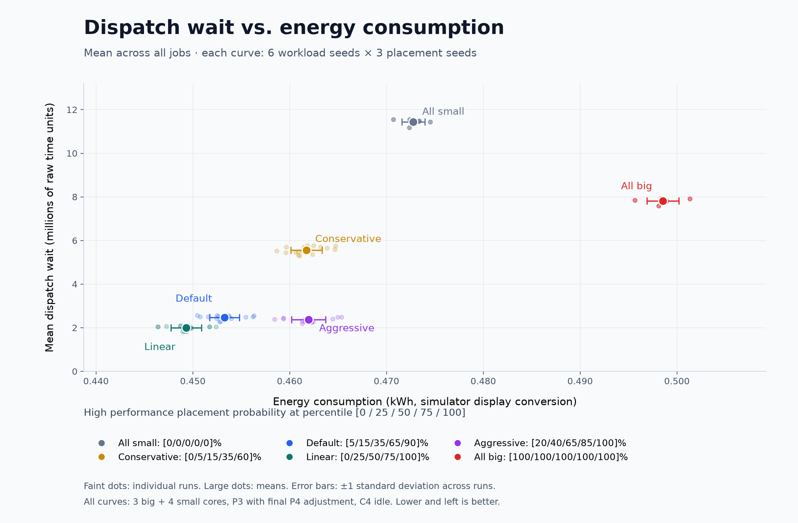

# Probabilistic queue placement measurements

October 6, 2026

The scheduler now assigns each arriving job to a high or low performance
queue using its percentile among previously admitted initial work sizes.
The configurable probability curve is interpolated at percentile points
0, 25, 50, 75, and 100. Both queues retain shortest-work ordering and jobs
keep their assigned core type until completion.

The [machine-readable results](scheduler-placement-results.json) include
108 paired runs: six probability curves, six workload seeds (0–5), and
three independent placement seeds (0–2). Each run completed all 6,666 jobs,
for 719,928 completed processes. The analyzer independently reconciled
queue counts and assigned work against observed context loads.

All runs use three enabled big cores and four enabled small cores, P3
with final-interval P4 adjustment, and C4 for unused enabled cores.
The comparison baseline assigns all jobs to small cores while retaining
the same enabled cores and idle settings. Percentages below are means
of paired percentage changes, with lower values indicating improvement.

| Curve | High probabilities at 0/25/50/75/100 | High jobs | Energy change | Runtime change | Mean turnaround change |
| --- | --- | ---: | ---: | ---: | ---: |
| All-small | 0 / 0 / 0 / 0 / 0 | 0% | 0% | 0% | 0% |
| Conservative | 0 / .05 / .15 / .35 / .60 | 21.03% | -2.34% | -8.83% | -51.17% |
| Default | .05 / .15 / .35 / .65 / .90 | 40.35% | -4.13% | -15.99% | -78.16% |
| Linear | 0 / .25 / .50 / .75 / 1 | 49.64% | -4.96% | -19.34% | -82.27% |
| Aggressive | .20 / .40 / .65 / .85 / 1 | 62.25% | -2.29% | -16.30% | -79.05% |
| All-big | 1 / 1 / 1 / 1 / 1 | 100% | +5.45% | -7.38% | -31.71% |

Linear performed best among these tested curves under these settings and is
now the scheduler default: `make run` uses probabilities 0/.25/.50/.75/1.
The “Default” label in this saved table, JSON, and plot refers to the original
example curve used when the measurements were captured; new benchmark sweeps
label that curve “example.” These seeds were used for comparison, so further
tuning should be evaluated on held-out workloads and placement seeds.

The reductions are relative to the same-capacity C4 baseline. The historical
four-small-core C6 energy minimum is a different configuration and consumes
less energy: for workload seed 0, default placement/seed 0 consumes
1,629,053,600 raw energy units versus its 1,135,116,600 full-interval
small-core C6 reference. Faster completion can reduce C4 idle residence,
even while big-core execution uses more active energy. Do not interpret
the table as improvement over the C6 energy minimum.

For workload seed 0, the final observed distribution is min 9,000, p25
12,000, median 15,000, p75 17,000, max 20,000 work units. With the default
curve and placement seed 0, the observed high placement fractions by
quartile are 8.95%, 23.21%, 52.40%, and 78.28%. The probabilities refer to
expected placement fractions; individual outcomes vary by seed.

## Dispatch wait versus energy



Each point represents total run energy and mean first-dispatch wait across
all jobs, weighted by the job counts in the high and low queues. Large points
show means across 18 runs per curve; faint points show individual runs, and
error bars show one standard deviation across runs. Wait uses raw simulator
time units, while energy uses the starter's kWh display conversion.
Linear has the lowest mean dispatch wait and energy among these six curves.
Download the [SVG](scheduler-dispatch-wait-vs-energy.svg) or
[summary CSV](scheduler-dispatch-wait-vs-energy.csv). Regenerate using
`python3 tools/plot_placement.py` with matplotlib installed.

`make test` also passed 56 simulation runs (127,772 completed processes),
covering mixed/default placement, endpoint curves, disabled core types,
zero-work jobs, equal sizes, new extrema, gaps, bursts, and generator seeds.
Positive-work small-only C6 runs matched the full-interval energy minimum.
Zero-work jobs on initially ready cores can consume one hardware interval,
so their checks require correct completion and work accounting without
requiring equality to the zero-cost per-job reference. Dedicated policy
checks cover quantiles, ties, interpolation, deterministic random replay,
sampling, capacity fallback, and invalid configuration.

Reproduce on Linux from the repository root:

```sh
make -C src test > /tmp/eec-placement-check.log
python3 tools/analyze_placement.py /tmp/eec-placement-check.log
make -C src placement-benchmark > /tmp/eec-placement-sweep.log
python3 tools/analyze_placement.py /tmp/eec-placement-sweep.log --output docs/scheduler-placement-results.json
```

The JSON includes source and simulator hashes, per-run configuration,
quantiles, percentile-band calibration, queue metrics, raw energy/runtime,
and paired summaries including variability across workload/placement seeds.
